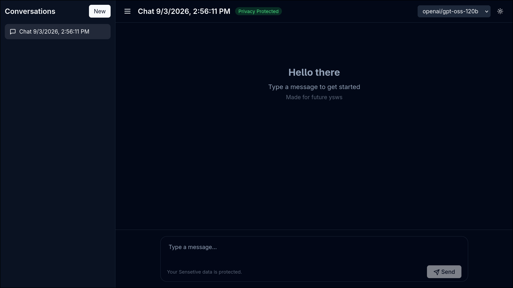
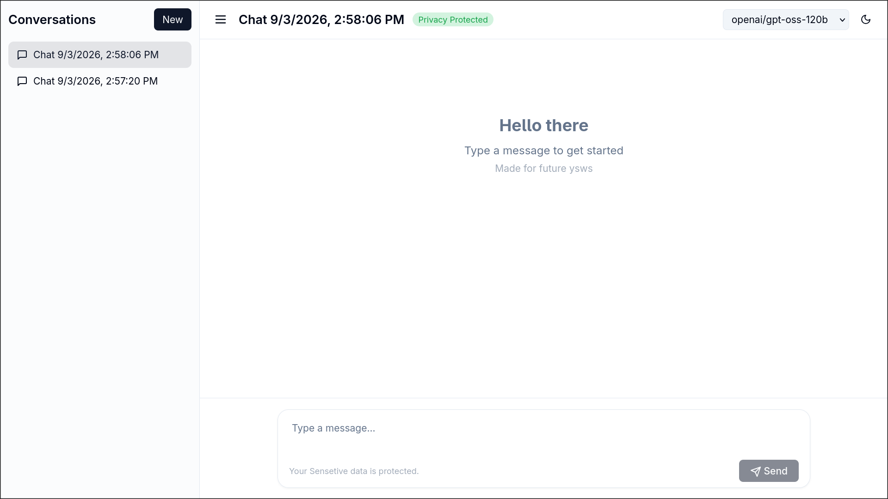
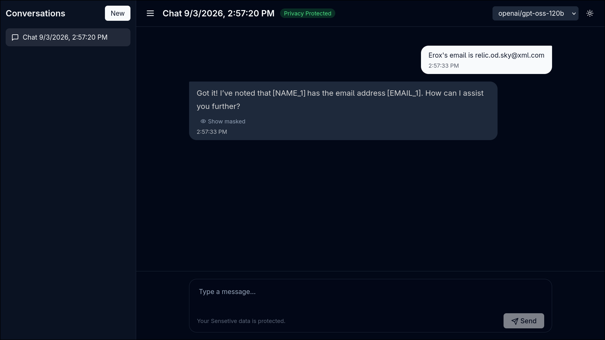
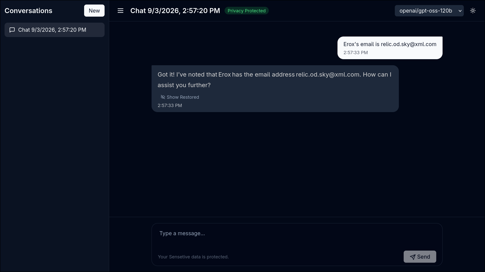

# Hbp100 V3 Web
 
let mut user = meee ;

hm now when i open the website and type something personal like

```go
My email is relic.od.sky@xml.com (its not a valid one though)
```
my email is feed to the llm , the providers might even use my email for one of their dataset's example ,
i didnt like tht so i simply build hbp100 , its a rust based tool with both rust and python support .
I know larpers hate rust but as performance maniac arch user , i cant sit with hundred ms latency because of py
thts why i literally rewrote the wholething(not in this repo but its worth mentioning) , ok now back to explaining :

```go
My email is [EMAIL_1]
```
hbp100 simply replaces the email with a placeholder (we are nt playing doppelganger rn),
and sends to the llm , the llm responds usually like :

```go
ok got it you email is [EMAIL_1]
```
and then hbp100 will simple swap the placeholder with the real value :

```go
ok got it you email is relic.od.sky@xml.com
```

Thts the very basic mechanism of hbp100 but there are a lot of others like sessions , context aware masking blah blah blah .

## Screenshots

Now for the lazy guy who dont wanna go to the web , dont worry i have got it :p
---


---


---

## Bugs section

On the last phrase of debugging , i did a lot of heavy lifting , fixed my own bug of my diff project(yeah i am using tht here but the hrs werent counted :c) , faced cors , came to know production is a boss not a filter like localhost also serverless vercel is as worse as hell and the final cherry on top , u block origin blocking my own backend lol . (actually i wrote it and thought it wd be my devlog but damn future didnt lemme post a devlog without lapse so i cp and pasted it here lol)

## Tree
```
.
├── assets
│   ├── black.png
│   ├── masked.png
│   ├── restored.png
│   └── white.png
├── hbp100-backend
│   ├── backend.py
│   └── requirements.txt
├── hbp100-frontend
│   ├── index.html
│   ├── package.json
│   ├── package-lock.json
│   ├── postcss.config.js
│   ├── src
│   │   ├── App.tsx
│   │   ├── index.css
│   │   └── main.tsx
│   ├── tailwind.config.js
│   ├── tsconfig.json
│   ├── tsconfig.node.json
│   └── vite.config.ts
└── README.md

5 directories, 18 files
```

> i just ran tree | wl-copy and pasted :p

## URL

```www
https://hbp100-v3-web.vercel.app
```
---

## Credits (i thought it is showed at the last of movies!)

-Hbp100 is a website based on assistant-ui , a open-source react based frontend for llms though i heavily modded it , my frontend still is a fork of assistant-ai.

-This project is the web adaptation of the Hbp100 rust crate .
>I am the author of it , lol.

and thts all for the credits

## Author 

"Name" = "Dipanjan Dutta"
Also i use arch btw

## licence

Do i even need one here?

## Ai uses 

To be honest , i used deepseek at the python initial footprint first then did the whole work myself and sorry reviewer i forgot to fill the ai uses section in future i am truly sorry but still it was limited to a lil portion you flagged the readme and everything.